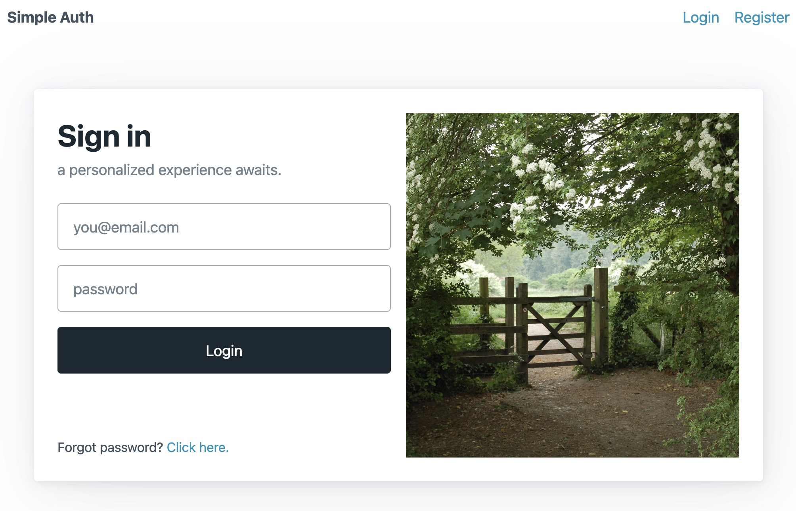

# Simple auth example with sveltekit



## No warranty expressed or implied

This code is provided for educational purposes only. The lesson embedded in this code may very well be "this is how not 
to do things." I make no assertions about the security of this code. I have made reasonable effort to follow best practices, 
but I am not a security expert, and make no claims that there are no backdoors or loopholes in this code creating 
vulnerabilities. Use at your own risk.

Likely this code is just fine as a starting point for protecting low value assets like an online course or such. Using 
this code to protect high value assets (financial data, personal info, etc.) without expert scrutiny and assistance would 
be just crazy.

## Summary

This is a self contained svletekit web site with public and protected routes combined with session token based user 
authentication. There are [other](https://joyofcode.xyz/sveltekit-authentication-using-cookies) [examples](https://blog.logrocket.com/authentication-svelte-using-cookies/) on the web, which are excellent.  But each seemed to leave out one or more details 
that made this topic challenging for my pea sized intellect. So I rolled my own example here mainly for self education 
purposes. I wonder what I left out?

Please open issues to identify errors or shortcomings in this example.

## Features

* Only hashed password saved in database.
* sqlite user database -- no external database required
* Any routes added under /src/routes/public are (you guessed it) public.
* Any routes added under /src/routes/protected are (wait for it) password protected.
* Any routes added under /src/routes/protected/admin are (...) only accessible by users of the "admin" group.
* init-users.js script is provided to create the database and Users table and generate some demo users.
* Built with 'pico.css' to keep it simple but not too painful on the eyes
* Includes email validation of new users
* Includes email validation of password reset

## Usage

```
git clone https://github.com/ejkreboot/svelteauth
cd svelteauth
npm install
node init-users.js
npm run dev
```
Then point your browser to [http://localhost:5173/](http://localhost:5173/).

**NOTE:** The '/public/auth/register' and '/public/auth/forgot' endpoints require an SMTP server to 
send confirmation emails. Provide your SMTP details in 'src/lib/config.js'. A template is provided 
as 'src/lib/config.js.ex'. (This is to avoid storing actual credentials on github, as config.js is
gitignored in this repo). This template works with [mailtrap.io](https://mailtrap.io) which is a 
fabulous tool for prototyping and testing, and you can get started for free (actually, given their 
generous limits, you could not only get started but actuall go a long ways for free). Other SMTP 
providers may require additional information to work with [nodemailer](https://nodemailer.com).

## Basic design

Requests are caught by 'hooks.server.js'. Requests for public routes are passwed through. Requests for 
Private routes are only passed if there is a session cookie with a token that matches a user token 
in the database. Requests for admin routes are only passed if there is both a valid user token and if 
the user is part of the "admin" group.

If there is valid session cookie (with a valid token), the user email and group are injected into session's 
local storage:

> src/hooks.server.js
```
  if (user) {
  ... 
  /* validate routes and then...*/
  ...

    event.locals.user = {
      email: user.email,
      group: user.group
    }
  }
 
  ...

```

The local storage is then loaded by the (aptly named) load function in the top level `+layout.server.js' which 
then exposes this information to the template as follows:

> src/routes/+layout.server.js
```
export const load = async ({ locals }) => {
    if(locals.user) {
      return {
        email: locals.user.email,
        group: locals.user.group
      }  
    } else {
      return {
        email: "",
        group: ""
      }  
    }
  }
```

>src/routes/+layout.svelte
```
<script>
    export let data;
</script>

...rest of template here, customized based on whether data.user is defined...

```

But where does the session cookie get set? That occurs via the login page ('src/routes/auth/login'). 
The default form action checks if the provided password (after hashing) matches the (hashed) password 
in the database, a session cookie is created. The cookie expires after one hour as presently coded, 
but this could be adjusted to your liking. See 'src/routes/auth/login/+page.server.js' for details.

## TO DO

* It would be nice to have a user administration dashboard to add/edit/remove users.

## Credits

Thanks to [cocoparisienne](https://pixabay.com/users/cocoparisienne-127419/), [Argus398](https://pixabay.com/users/argus398-343496/), [pixel2013](https://pixabay.com/users/pixel2013-2364555/), [ktphotography](https://pixabay.com/users/ktphotography-5847971/), and [Claire05](https://pixabay.com/users/claire05-9411250/) from [Pixabay](https://pixabay.com) for the royalty free, no cost images used in this project.
